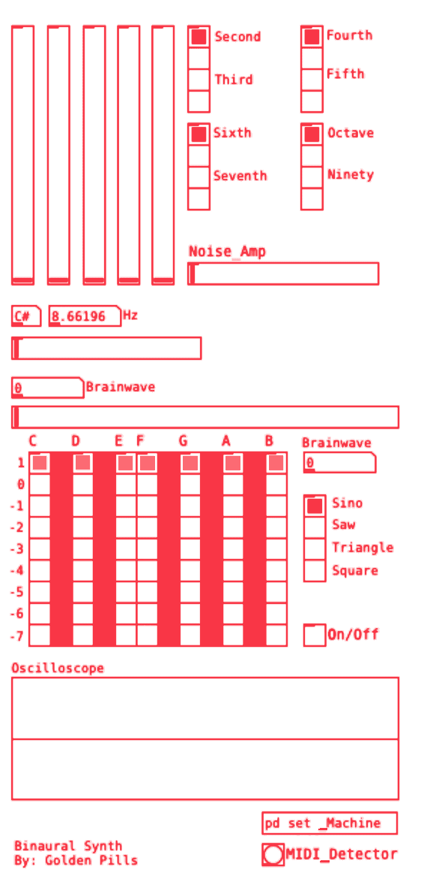
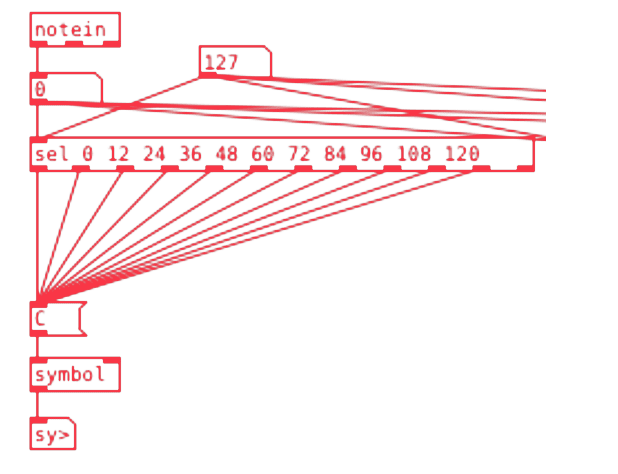

**Golden Pills**, productor. Utilizó este patch en su EP [«Anna Is Sad»](https://open.spotify.com/album/6nbHdzYCuSGWby9ioOZAd3?si=B7J2jpa2Sw2ayS6rAwWecg&fbclid=IwAR3qWUfJfWPiVWlVDbCyvExp7Ry4NDSlUU18o3QsZoXi8sLkBDY3BXbD4rE&nd=1). Contáctalo a través de [Instagram](https://www.instagram.com/golden_pills.wav/?igshid=sab6lolk7tbm&fbclid=IwAR1gF9j0Lotrjch8DjHuZ45b6-Ni0nnRKqHyIoFRDnbnzRz85MTTL77bQVE).

Patches y textos disponibles en el [repositorio de [iom!]](https://github.com/iomfanzine/).

---

# Sintetizador Binaural

Este sintetizador fue hecho con la finalidad de hacer música con ondas cerebrales. A diferencia de muchos otros generadores, éste cuenta con armonías y diferentes timbres.

Su funcionamiento es bastante simple, creando una disonancia en el oído derecho y la nota
musical en el izquierdo. Gracias a que la diferencia entre la nota musical y la disonancia es minúscula, el cerebro buscará sincronizarla con la disonancia. La disonancia es equivalente a la onda cerebral deseada, por lo que si queremos una onda alfa, por ejemplo 8 Hz, tendría que haber 440 Hz en el oído izquierdo y 448 Hz en el oído derecho. El efecto producido se escuchará similar al de un LFO o vibrato.

Este sintetizador funciona bajo la afinación de A4 a 440 Hz, por lo que todas las notas producidas por este sintetizador están relacionadas a dicho ajuste. También las ondas cerebrales están afinadas para obtener una mejor armonía en los acordes y en la nota en sí misma.

Por ejemplo, una onda Alfa de 8.1758 Hz es lo mismo que Do -1.

## Partes del sintetizador

### Intervalos

En la parte superior a la derecha, podemos observar unos objetos [vradio] de 4 celdas, cada uno controla una nota superior a la tónica. Es decir que uno puede dar variantes entre intervalos de segunda o tercera mientras que otro puede dar intervalos de cuarta o quinta. En total son 4 objetos [vradio] que suman armónicos a la nota fundamental.

### Control de ganancias

A la izquierda de la zona de intervalos, se encuentra el control de ganancia. No se
escuchará ningún intervalo si los 5 objetos [vslider] están en cero. Cada uno ajusta la ganancia de los radios anteriormente comentados, siendo el primero el control de nivel para la nota fundamental.

### Controlador de pitch

Debajo de la zona de ganancia, encontramos un slider horizontal con el que se selecciona la nota musical deseada. En su lugar, también podemos utilizar un controlador MIDI.

### Controlador de onda cerebral

El controlador se encuentra justo arriba del osciloscopio y funciona como un sistema de
coordenadas, el eje _x_ corresponde a las notas musicales, mientras que el eje _y_ numera las octavas.

Un indicador a la derecha nombrado _brainwave_ nos indica qué tipo de onda estamos manejando. También es posible usar ondas personalizadas con el slider que se encuentra en el área superior y debajo del [hslider] de pitch.

### Forma de onda

Debajo del indicador de _brainwaves_ y a la derecha del controlador, se encuentra un [vradio] con 4 celdas, las cuales nos permiten cambiar a los 4 tipos de onda principales. Debajo de este radio se encuentra un interruptor el cual nos sirve para prender y apagar el osciloscopio.

### Noise

En la parte inferior de la zona de intervalos, podemos apreciar un slider que dice _noise_ el cual con manipularlo simplemente podemos controlar la ganancia de ruido si es que queremos usarlo.

## Funcionamiento

Los patches llamados *set_(n)*, son los que se encargan de hacer las operaciones matemáticas que generan los diferentes tipos de intervalos en las armonías.

Los resultados de las operaciones son mandados a un oscilador, el cual manda una señal sin alterar y otra con la onda cerebral directamente al objeto [dac~] creando así el efecto envolvente.

Dentro del oscilador nos encontramos con 4 mensajes, los cuales se encargan de cambiar la forma de onda.

En el subpatch _brainwaves_ es donde se encuentran los algoritmos encargados de cambiar las frecuencias. Por medio del sistema de coordenadas anteriormente mencionado, se controlan y mandan las señales de las frecuencias infrasónicas.

El subpatch _Music notes_ es el sistema que se encarga de decirnos a qué nota pertenece la frecuencia
infrasónica para así usar el sistema de afinación a nuestro favor en la composición.

Y por último y no menos importante, el subpatch *set_noise* es el generador de ruido con un oscilador cuya frecuencia es la misma que la de la onda cerebral, ayudando a estimular aún más el efecto que caracteriza este sintetizador.

---

**Golden Pills**, productor. Utilizó este patch en su EP [«Anna Is Sad»](https://open.spotify.com/album/6nbHdzYCuSGWby9ioOZAd3?si=B7J2jpa2Sw2ayS6rAwWecg&fbclid=IwAR3qWUfJfWPiVWlVDbCyvExp7Ry4NDSlUU18o3QsZoXi8sLkBDY3BXbD4rE&nd=1). Contáctalo a través de [Instagram](https://www.instagram.com/golden_pills.wav/?igshid=sab6lolk7tbm&fbclid=IwAR1gF9j0Lotrjch8DjHuZ45b6-Ni0nnRKqHyIoFRDnbnzRz85MTTL77bQVE).

Patches y textos disponibles en el [repositorio de [iom!]](https://github.com/iomfanzine/).
