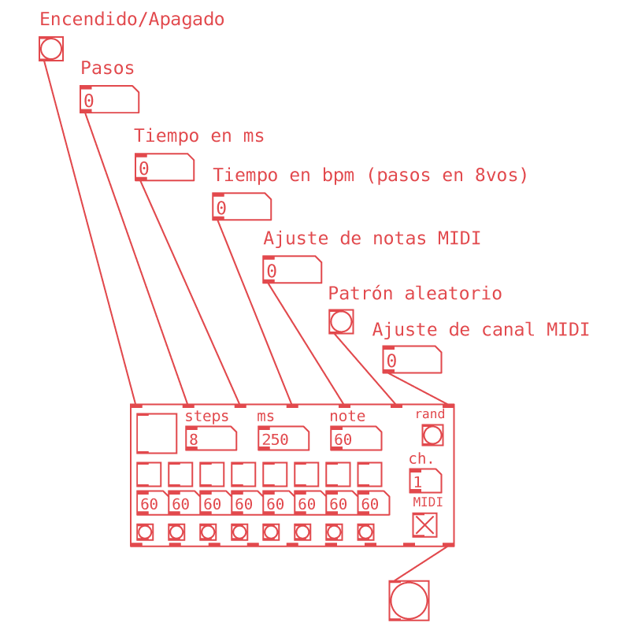
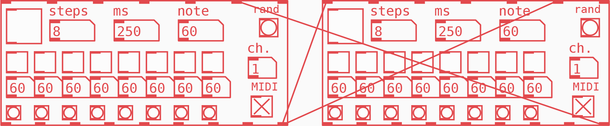
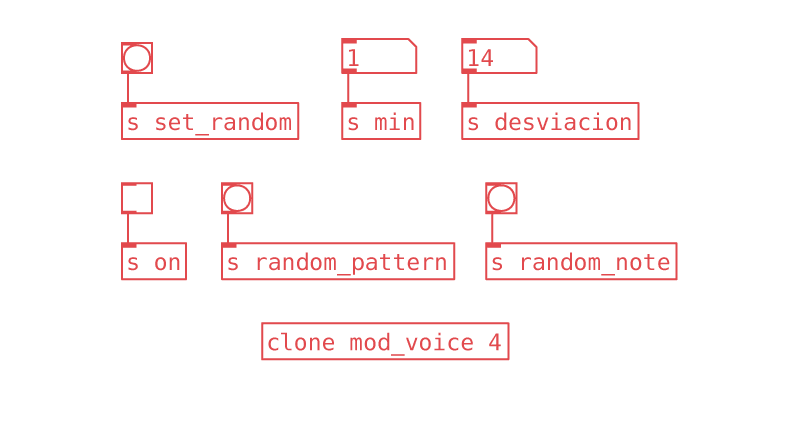

**Martín Rivera**, músico y desarrollador. El secuenciador modular ha sido utilizado en las piezas [Traveling Phase](https://www.youtube.com/watch?v=vkVvR9r8xtE) y [Topologies](https://www.youtube.com/watch?v=xqDmytOMzMs) de la serie «Rhythm Meditations». Envía un correo a developer.martinrivera@gmail.com para contactarlo.

Patches y textos disponibles en el [repositorio de [iom!]](https://github.com/iomfanzine/).

---

# Secuenciador Modular

El primer amor no se olvida. Pure Data fue mi primer amor en el mundo de la programación. Aunque han pasado varios años y he podido diversificar mi repertorio como _coder_ aún busco oportunidades para utilizar esta increíble plataforma, a veces con fines didácticos pero también para desarrollar herramientas y hacer música.

Desde mi perspectiva, Pd me parece ideal para crear proyectos pequeños pero reutilizables y con gran velocidad en cuanto a sus iteraciones. Propuestas grandes que requieren mantenimiento y suelen llegar a usuarios como un paquete terminado son más factibles de trabajar en otras plataformas, siendo el contraejemplo perfecto [Automatonism](https://www.automatonism.com/). De aquí la idea de crear una abstracción que pueda existir en diferentes contextos.

Un pequeño secuenciador llevaba tiempo en mi carpeta de abstracciones, hasta se caló en algunos conciertos, pero sentí la necesidad de llevarlo a un punto en el que otros usuarios pudieran utilizar una versión estable, bien organizada y con suficiente documentación. Entonces nació _The Modular Sequencer_.

Esta abstracción, por un lado, permite crear patrones rítmicos sencillos, por otro tiene la versatilidad para lograr sistemas rítmicos complejos que llevan a resultados inesperados. Fundamentalmente es una caja de ritmos MIDI de 8 pasos, entonces, ¿qué tiene de modular?

La modularidad reside en que, además de mandar mensajes MIDI tenemos diferentes salidas para mandar _bangs_ con pasos individuales del secuenciador o cada vez que en la secuencia hay un paso activo. Esta dinámica permite usar dichos _bangs_ para controlar más secuenciadores modulares, o cualquier otro objeto dentro del patch, creando redes de control que se alteran a sí mismas.

Iniciar o detener el secuenciador, crear un nuevo patrón aleatoriamente, mandar un mensaje para cambiar el tempo o el número de pasos, cambiar el canal MIDI, todo esto se logra fácilmente desde sus _inlets_ e interfaz gráfica. La comunicación entre los secuenciadores dentro del patch resulta en secuencias generativas, ensambles politémpicos, contrapuntos melódicos o densas texturas rítmicas.

Una función interesante es utilizar esta abstracción dentro del objeto [clone]. Podemos emplear [clone] cuando diseñamos un sintetizador polifónico o un instrumento de síntesis granular, ya que en resumen, nos permite generar un número arbitrario de instancias de un subpatch y así escalar su funcionalidad. Si utilizamos nuestra abstracción dentro de este objeto podemos generar cuantas secuencias rítmicas queramos.

Digamos que creamos un nuevo patch de Pd con la funcionalidad deseada, en este caso un objeto [mod_seq] con diferentes objetos [receive] hacia los _inlets_, por ejemplo un objeto para recibir _bangs_ en el penúltimo [inlet] del secuenciador y generar un patrón aleatorio, uno para iniciar y detener la secuencia, y un objeto [random] que asigne notas aleatoriamente, este puede tener un objeto [loadbang] para asignar una nota cuando inicializamos o un [receive] para seleccionar nuevas notas cada vez que nos dé el capricho.

Ahora en nuestro patch principal insertamos un objeto [clone]. Agregamos como primer argumento el nombre del patch que acabamos de crear sin la extensión _.pd_

Como segundo argumento especificamos el número de réplicas que deseamos. Desde el patch principal podemos utilizar los respectivos objetos [send] para comunicarnos con las instancias y controlar los parámetros de nuestro ejército de clones.

Existen opciones avanzadas de este objeto, pero aún con simples [send] y [receive] se logran resultados interesantes. Puedes explorar las funciones de este objeto dando click derecho y seleccionando el menú de _Ayuda_ o _Help_ para abrir un patch donde se explican los controles y la función de los inlets y outlets.

Descarga la abstracción desde [Patchstorage](https://patchstorage.com/the-modular-sequencer/) o desde el repositorio en [Github](https://github.com/mrtnRivera/modular-sequencer). ¡Espero te diviertas haciendo música con esta herramienta!

---

**Martín Rivera**, músico y desarrollador. El secuenciador modular ha sido utilizado en las piezas [Traveling Phase](https://www.youtube.com/watch?v=vkVvR9r8xtE) y [Topologies](https://www.youtube.com/watch?v=xqDmytOMzMs) de la serie «Rhythm Meditations». Envía un correo a developer.martinrivera@gmail.com para contactarlo.

Patches y textos disponibles en el [repositorio de [iom!]](https://github.com/iomfanzine/).
